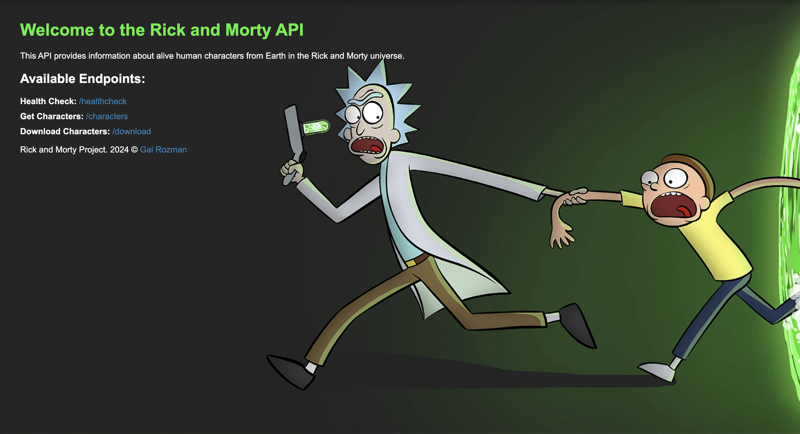

----
### Introduction
---
This app is a Flask-based RESTful web application that interacts with the Rick and Morty API to retrieve and manage character data. It filters the data to include only human characters who are alive and have a location that mentions “Earth.” The app offers both a user-friendly web interface and RESTful API endpoints for seamless interaction. Users can view the filtered character data on a webpage, retrieve it as JSON via an API endpoint, or download it as a CSV file. The app includes health check functionality to monitor the status of the API and application, logging all events for transparency.
### Project Scope
---
To navigate through the components of this repository, use the contents table below:
- [Basic usage with Docker Image (This page)](https://github.com/ThePinkPanther96/r-m-api-k8s-pipline/blob/main/README.md)
- [RESTful application](https://github.com/ThePinkPanther96/r-m-api-k8s-pipline/blob/main/app/README.md)
- [K8s Cluster](https://github.com/ThePinkPanther96/r-m-api-k8s-pipline/blob/main/k8s/README.md)
- [Helm Chart Deployment](https://github.com/ThePinkPanther96/r-m-api-k8s-pipline/blob/main/helm/rick-n-morty/README.md)
- [Workflow Actions](https://github.com/ThePinkPanther96/r-m-api-k8s-pipline/blob/main/.github/workflows/README.md)

### Usage with Docker Image
---
#### How to Build and Run the Docker Image:

1. Build the Docker Image:
	```shell
	docker build -t rick-and-morty-app .
	```
2. Run the Docker Container:
	```shell
	docker run -d -p 5002:5002 --name rick-n-morty rick-and-morty-app
	```
	This maps the container’s port 5010 to your host’s port `5002`.

#### Testing the Application:
1. Open a web browser and search for `curl http://localhost:5002/`
2. You will be greeted by the home page:
   
